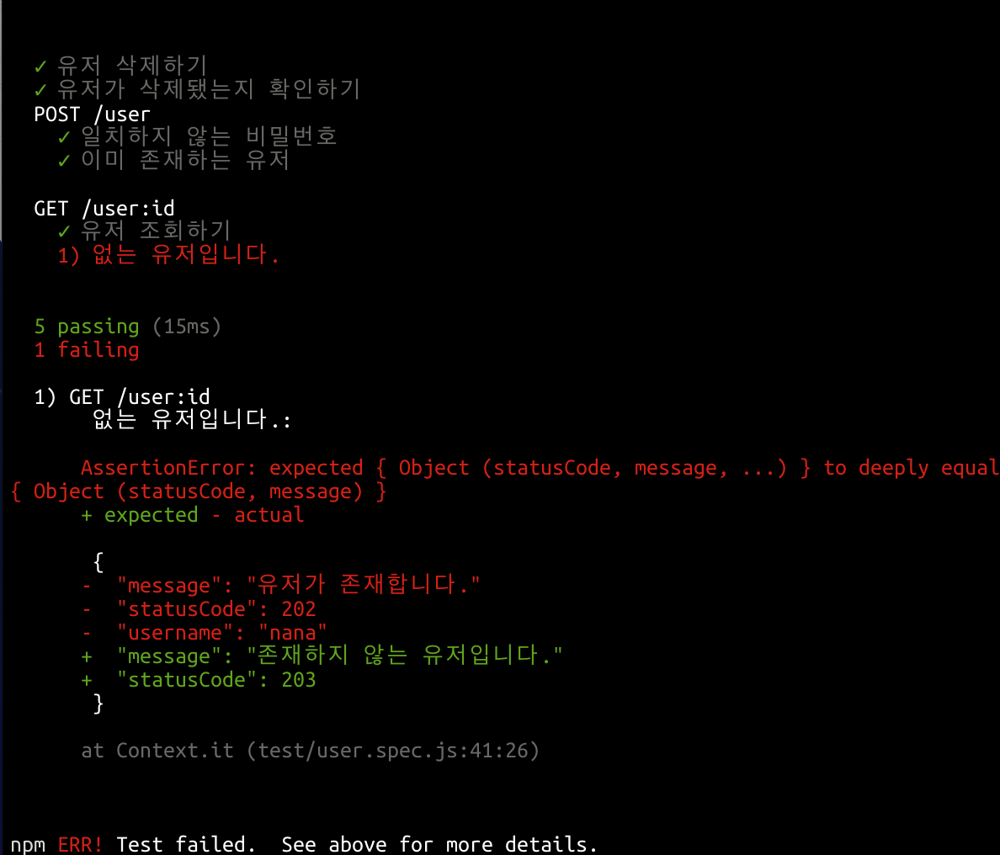

## 테스트 주도 개발 패턴

1. 자동화된 테스트
2. 격리된 테스트 - 테스트끼리의 영향은 없어야 한다.
3. 테스트 목록 - 시작하기전에 실행할 테스트들을 모두 기록한다.
4. 테스트 우선 - 테스트 대상이 되는 코드를 작성하기 전에 테스트를 작성해라
5. 단언 우선 - assert는 제일 먼저 쓰고 시작한다.
   - 완료된 시스템이 어떨거라 알려주는 테스트부터 작성한다. 
   - 특정 기능을 개발할 때 기능이 완료되면 통과할 수 있는 테스트부터 작성한다.
   - 완료될 때 통과해야 할 단언부터 작성한다.
6. 테스트 데이터 - 테스트를 읽을 때 직관적인 데이터를 사용해라.
7. 명백한 데이터 - 테스트 자체에 예상되는 값과 실제 값을 포함하고 이 둘 사이의 관계를 드러내기 위해 노력해라. 여기서 매직넘버를 사용하는 것이 허용된다.


## 빨간 막대 패턴

1. 한 단계 테스트 - 각 테스트는 한 단계 진전을 시켜주되, 너무 커서는 안된다.
2. 시작 테스트 - 오퍼레이션이 아무 일도 하지 않는 경우를 먼저 테스트
3. 설명 테스트 - 자동화된 테스트를 더 널리 쓰이게 하기 위해 테스트를 통해 설명을 요청하고 테스트를 통해 설명한다. 시퀀스 다이어그램을 테스트를 통해 설명하는 그런 느낌
4. 학습 테스트 - 외부에서 만든 소프트웨어를 테스트를 통해 학습해간다.
5. 또 다른 테스트 - 주제와 무관한 아이디어가 떠오르면 todo list에 적어놓고 주제로 돌아올 것
6. 회귀 테스트 - 시스템 장애가 보고될 때 장애로 인하여 실패하는 테스트, 통과할 경우에는 장애가 수정됐다고 볼 수 있는 테스트를 간단하게 작성한다.
7. 다시하기 - 길을 잃었을땐 다시 해봅니당.


## 27장 테스팅 패턴

상세한 테스트 작성법에 대하여 

1. **자식 테스트**

   지나치게 큰 테스트 케이스를 작성했을 때?

   - 일단 지우고 그보다 작은 테스트 케이스들을 작성한다.

   - 그 다음 큰 테스트 케이스를 작성한다.
   - 큰 테스트 케이스를 만들었을 때 왜 그러한 테스트 케이스를 작성했는지 돌아본다.

2. **모의 객체**

   비용이 많이 들거나 복잡한 리소스에 의존하는 객체를 테스트하려면?

   - 상수를 반환하게끔 만든 속임수 버전의 리소스를 만든다.
   - 대표적인 예가 데이터베이스

3. **셀프 션트(self shunt)**

   한 객체가 다른 객체와 올바르게 대화하는지 테스트하려면?

   - 테스트 대상이 되는 객체가 원래의 대화 상대가 아니라 테스트 케이스와 대화하도록 만든다. 

4. **로그 문자열**

   메시지의 호출 순서가 올바른지를 검사하려면?

   - 로그 문자열을 가지고 있다가 메시지가 호출될 때마다 그 문자열에 추가하도록한다.
   - 예시에서는 아예 WasRun이란 class를 만들고 log 문자열에 누적되어 추가되도록하였다.

5. **크래시 테스트 더미**

   호출되지 않을 것 같은 에러코드를 어떻게 테스트할까?

   - 실제 작업 수행 대신 그냥 예외를 발생시키기만 하는 특수한 객체를 만들어서 이를 호출한다.

6. **깨진 테스트**

   개인 프로그래밍할때 마지막 테스트가 깨진 상태로 끝마치는 것이 좋다.

   - 왜? 다시 업무로 돌아왔을 때 뭘 해야할지 명확해지기 때문에

7. **깨끗한 체크인**

   팀 프로그래밍할때 모든 테스트가 성공한 상태로 끝마치는 것이 좋다. 

   - 팀 프로젝트에서 체크인을 했을 때 이전의 작업이 모두 끝나있다는 확신을 갖게 하기 위함

   

1~7번중 직접 해볼 수 있는 패턴들은 2, 3, 4, 5번이다. 

1번의 경우 우발적으로 발생했을 때 1번의 수칙을 지켜 행동하는 것으로 하고 개인 프로젝트이므로 6번을 이행해보도록 한다.

일단 나는 유저의 post method를 구현하는 중이었는데, 이를 테스트해보면서 시작한다.


기존의 user.js 코드

```javascript
const bcrypt = require('bcrypt');
const fs = require('fs');
const saltRounds = 4;

class User {
  constructor() {
    this.exec = { "POST" : this.post, "GET" : this.get, "DELETE" : this.delete };
  }

  async post(query) {
    const rawData = fs.readFileSync(`./data/user.json`)
    const users = await JSON.parse(rawData);
    const { username, password, passwordConfirm } = query;
    if ( password !== passwordConfirm) {
      return { statusCode: 203, message: '비밀번호가 일치하지 않습니다.' };
    }
    
    if (users.some(tmpuser => tmpuser.name === username)) {
      return { statusCode: 203, message: '이미 존재하는 유저입니다.' };
    }
    const encryptedPassword = await bcrypt.hash(password, saltRounds);
    users.push({ name : username, password : encryptedPassword });
    fs.writeFileSync(`./data/user.json`, JSON.stringify(users));
    return { statusCode: 202, message: '회원 가입 완료!' };
  }

  get() {
  
  }
  delete() {

  }
  

}

module.exports = User;
```


user.spec.js

```javascript
const User = require('../user');
const should = require('chai').should();

const user = new User();

describe('POST /user', () => {
  it('일치하지 않는 비밀번호', async () => {
    const query = { username : 'nailer', password : '12345', passwordConfirm : '54321' };
    const response = await user.exec["POST"](query);
    response.should.deep.equals({ statusCode: 203, message: '비밀번호가 일치하지 않습니다.'});
  });
  it('이미 존재하는 유저', async () => {
    const query = { username : 'nailer', password : '12345', passwordConfirm : '12345' };
    const response = await user.exec["POST"](query);
     response.should.deep.equals({ statusCode: 203, message: '이미 존재하는 유저입니다.'});
  });
});
```

**셀프션트** 를 제대로 이해한게 맞다면 이 코드 또한 서버 객체와 통신하는게 아닌 테스트케이스와 통신하는 것이기 때문에 셀프션트에 부합한다고 볼 수 있다.


데이터 베이스 대신 users라는 배열을 임의로 만들어서 활용해볼수 있다.


새로운 유저를 생성시키는 테스트를 어떻게 지속적으로 통과하도록 만들까?

딱히 방도가 생각나지 않아서 delete를 구현한 후에 생성하고 지우고를 반복하기로 한다.

```javascript
describe('DELETE /user:id', async () => {
  const newUser = { username : 'nana', password : '12345', passwordConfirm: '12345' };
  await user.exec["POST"](newUser);
  it('유저 삭제하기', async () => {
    const query = { username : 'nana', password : '12345' };
    const response = await user.exec["DELETE"](query);
    response.should.deep.equals({ statusCode: 202, message: '유저를 삭제했습니다.'});
  });
});
```

해당 statusCode와 message를 날릴 수는 있지만 유저가 실제로 삭제됐는지 확인할 수 있어야 한다.

삭제된 것을 확인하려면 GET method를 체크해야 한다.


리스트를 작성하자.

1. GET method를 통해 유저 정보를 받아오기.
2. GET method를 통해 유저 정보를 받아올 수 없다면, 없다고 말해주기.
3. DELETE 구현하기


```javascript
describe('GET /user:id', async () => {
  it('유저 조회하기', async () => {
    const query = { username : 'nana', password : '12345' };
    const response = await user.exec["GET"](query);
    response.should.deep.equals({ statusCode: 202, message: '유저가 존재합니다.', username: 'nana' });
  });
  it('없는 유저입니다.', async () => {
    const query = { username : 'stephens', password : '12345' };
    const response = await user.exec["GET"](query);
    response.should.deep.equals({ statusCode: 203, message: '존재하지 않는 유저입니다.' });
  });
});
```





**get 기능을 구현한다.**

```javascript
async get(username) {
    const rawData = fs.readFileSync('./data/user.json');
    const users = await JSON.parse(rawData);
    if (users.some(tmpuser => tmpuser.name === username)) {
      return { statusCode: 202, message: '유저가 존재합니다.', username: username };
    }
    return { statusCode: 203, message: '존재하지 않는 유저입니다.' };
  }
```


```javascript
describe('GET /user', async () => {
  it('유저 조회하기', async () => {
    const username = 'nana';
    const response = await user.exec["GET"](username);
    response.should.deep.equals({ statusCode: 202, message: '유저가 존재합니다.', username: 'nana' });
  });
  it('없는 유저입니다.', async () => {
    const username = 'stephens';
    const response = await user.exec["GET"](username);
    response.should.deep.equals({ statusCode: 203, message: '존재하지 않는 유저입니다.' });
  });
});
```


delete작업은 해당 유저만이 수행할 수 있어야 하기 때문에 해당 유저 id의 session을 갖고 있는 유저만이 할 수 있도록 하고 싶다.

session을 직접 구현하지 않고 임의의 session을 작성하여 테스트를 해본다.

**delete 기능 구현**

```javascript
describe('DELETE /user:id', async () => {
  const newUser = { username : 'kaka', password : '12345', passwordConfirm: '12345' };
  await user.exec["POST"](newUser);
  it('유저 삭제하기', async () => {
    const query = { sid : '125236281432', name : 'kaka' };
    const response = await user.exec["DELETE"](query);
    response.should.deep.equals({ statusCode: 202, message: '유저를 삭제했습니다.'});
  });
});
```

pid와 name을 갖고 있는 임의의 session을 만들어서 query에 집어넣는다.

그리고 mocksessions라는 배열을 user.js 파일에 넣어준다.

```javascript
async delete(query) {
    const { sid, name } = query;
    const delIdx = mockSessions.findIndex(el => el.sid === sid && el.name === name);
    // 임시 세션
    if (delIdx === -1) {
      return { statusCode: 203, message: '잘못된 접근입니다.' };
    }
    await users.splice(delIdx, 1);
    fs.writeFileSync(`./data/user.json`, JSON.stringify(users));
    return { statusCode: 202, message: '유저를 삭제했습니다.'};
  }
}

```

```javascript
describe('DELETE /user:id', async () => {
  const mockSessions = [{ sid : '125236281432', name : 'nana' }, 
                      { sid: '5123412352134', name : 'nailer'},
                      { sid : '125236281432', name : 'kaka' },];
  const newUser = { username : 'kaka', password : '12345', passwordConfirm: '12345' };
  await user.exec["POST"](newUser);
  it('유저 삭제하기', async () => {
    const query = { sid : '125236281432', name : 'kaka' };
    const response = await user.exec["DELETE"](query, mockSessions);
    response.should.deep.equals({ statusCode: 202, message: '유저를 삭제했습니다.'});
  });
});
```

모의 객체를 test code쪽으로 빼는 것이 좀 더 바람직할 것 같았다.


